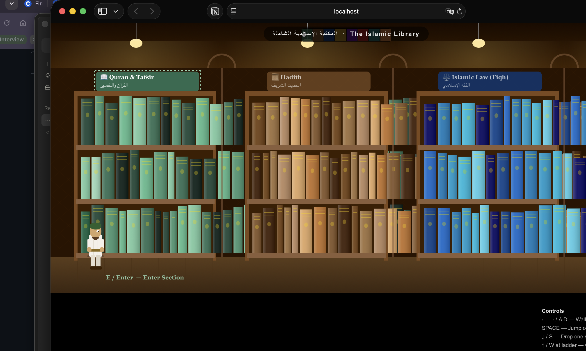
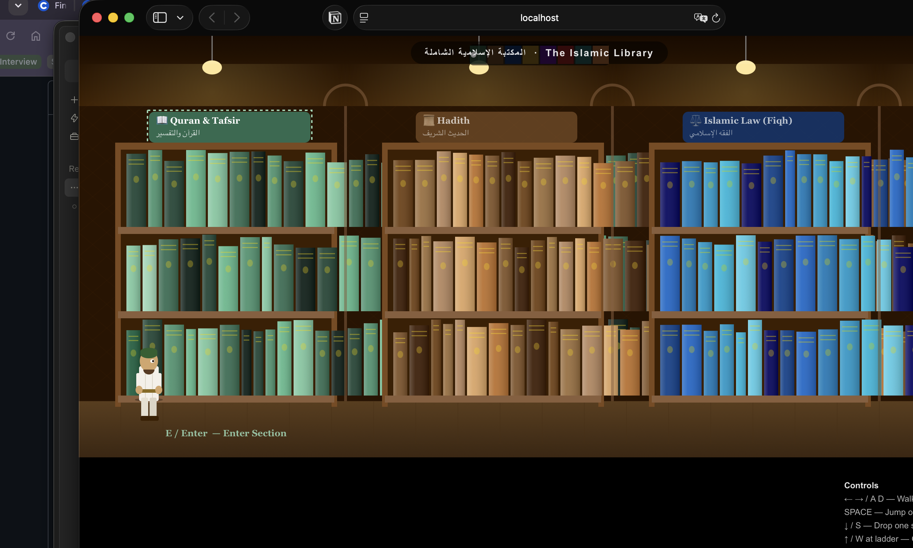

# المكتبة الإسلامية الشاملة · The Islamic Library

An interactive, side-scrolling library explorer built with **Next.js** and the **HTML5 Canvas API**. Walk your character through a grand Islamic library corridor, jump into any of 8 themed sections, climb shelves, and open detailed pages for over **800 real Islamic books**.

---

## Screenshots

### The Library Corridor


Walk through the main corridor and discover eight thematic sections — each with its own colour palette, icon, and hundreds of books on the shelves.

### Section Overview


Approach any bookshelf section to see the glowing section sign. Double-press **Space** to fly in, or press **E / Enter** to walk through the door.

---

## Features

### 🏛️ Main Corridor
- **Walk** left / right with `← →` or `A / D`
- **Single jump** with `Space`
- **Double-jump** (second `Space` mid-air) bursts toward the nearest section and flies you inside it
- Animated player with squash-and-stretch, ghost trail, dust burst, and double-jump ring effect
- Minimap showing your position across all 8 sections

### 📚 Section Rooms
- Two shelf levels (top + bottom) plus the floor — each packed with upright books
- **Single jump** to land on the lower shelf; **double-jump** from the shelf to reach the top shelf
- **Arrow Down / S** to drop one shelf level at a time
- **Wooden ladders** appear every 15 books in the empty gaps between columns:
  - `↑ / W` near a ladder → smooth climbing animation up one level
  - `↓ / S` near a ladder → smooth climbing animation down to the floor
- Animated climbing pose: alternating arms, swaying body, directional arrow above head
- Walk left into the exit door to **automatically fly back** to the corridor (with a falling-from-top re-entry animation)
- **ESC** also exits back to the corridor at any time

### 📖 Book Interaction
- Walk near any book to see a floating tooltip (auto-sized to the text):
  - **Arabic title** (gold)
  - **English title** (white)
  - **Author** (section accent colour)
- Press **E** or **Enter** to open the full book detail modal

### 🗂️ 800 Real Islamic Books across 8 Sections

| Section | Icon | Books |
|---|---|---|
| Quran & Tafsir | 📖 | 100 — tafsir classics, Quranic sciences, qira'at |
| Hadith | 📜 | 100 — the six books, musnad collections, rijal works |
| Islamic Law (Fiqh) | ⚖️ | 100 — all four madhabs, usul al-fiqh, contemporary fiqh |
| Seerah (Prophet's Life) | 🌙 | 100 — classical and modern biographies of the Prophet ﷺ |
| Aqeedah (Theology) | 🕌 | 100 — creedal texts from all Sunni schools |
| Islamic History | 🏰 | 100 — universal histories, dynasties, civilisational works |
| Spirituality (Tasawwuf) | ✨ | 100 — Sufi classics, tazkiyah, ethics |
| Arabic Language | ✍️ | 100 — grammar primers, dictionaries, rhetoric |

---

## Controls

| Key | Action |
|---|---|
| `← → / A D` | Walk |
| `Space` | Jump |
| `Space` × 2 in air | Fly into nearest section |
| `↑ / W` near ladder | Climb up one shelf |
| `↓ / S` | Drop one shelf down |
| `↓ / S` near ladder | Climb down one shelf |
| `E / Enter` | Enter section · Read book |
| `ESC` | Exit section → back to corridor |

> Mobile touch controls (walk, jump, E) are shown automatically on small screens.

---

## Tech Stack

| | |
|---|---|
| Framework | [Next.js](https://nextjs.org) 15 (App Router) |
| Rendering | HTML5 Canvas API — no game engine |
| Language | TypeScript |
| Styling | Tailwind CSS |
| Animation | `requestAnimationFrame` game loop at 60 fps |

---

## Getting Started

```bash
# Install dependencies
npm install

# Run the development server (requires Node.js ≥ 20)
npm run dev
```

Open [http://localhost:3000](http://localhost:3000) in your browser.

---

## Project Structure

```
├── app/
│   ├── layout.tsx           # Root layout & metadata
│   └── page.tsx             # Entry point — lazy-loads the canvas game
├── components/
│   ├── LibraryGame.tsx      # Main canvas game (corridor + room modes)
│   ├── BookDetailModal.tsx  # Full book detail overlay
│   └── BookModal.tsx        # Book preview modal
├── data/
│   └── books.ts             # 800 Islamic books across 8 sections
└── public/
    └── screenshots/         # README screenshots
```

---

## License

This project is for educational and cultural purposes. All book titles, authors, and descriptions reference real published works in the Islamic scholarly tradition.
